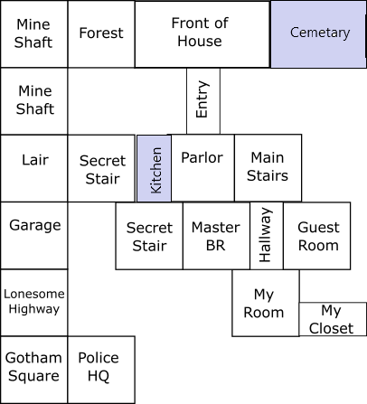

# Sample Text Adventure

A simple RPG to illustrate the design of text adventures and interactive fiction.

## Characters

- You, the would-be hero. You have no backstory.
- Robin, your friend of indeterminate gender.
- Al, your personal assistant, bodyguard, and driver. He did something during the war.
- Betty, your hot-tempered sister. She doesn't do much.
- Some monsters, I guess.

## Setting

Most of the story takes place in Castle Hall Manor, a spooky Gothic futuristic mansion hotel sort of thing.

## Plot

You have received a frantic text from Robin pleading for help. You need to find a golden popsocket before it is too late.

## Conflict

Robin is in some sort of trouble. It is probably your fault. We will figure it out.

## Resolution

You need to find (and hopefully save) Robin, recover your popsocket, and escape Castle Hall Manor Inn.

## Mechanics

It's a text adventure. Mostly there will be reading, clicking, and maybe typing. In addition, you may have specific actions you allow your characters to perform.

## Story beats

Story (or game) beats are the significant events that drive a story forward and determine its outcome. In a nonlinear game, they may happen at different times in different playthroughs.

- Describe the setting, and any changes it goes through during your story. For example, Zork begins in a rather benign pastoral setting. Then there is a house, a forest, a cave, etc. Don't worry about specific rooms at first. We are concerned with settings that change something significant about the mood or gameplay. (If you have more than 7-10 distinct settings, you may wish to rethink your scope.)  
- What are the main points in the plot? These will mostly be described in terms of player decisions. Is there a climactic episode in your game? Is there an initiating event?
- Are there important objects, mechanics, or other non-character elements in your game?

### Locations

- Castle Hall Manor and grounds
  - upstairs
  - downstairs
  - front of house
  - woods
  - family plot
- downtown Gotham
- secret lair below the Manor house